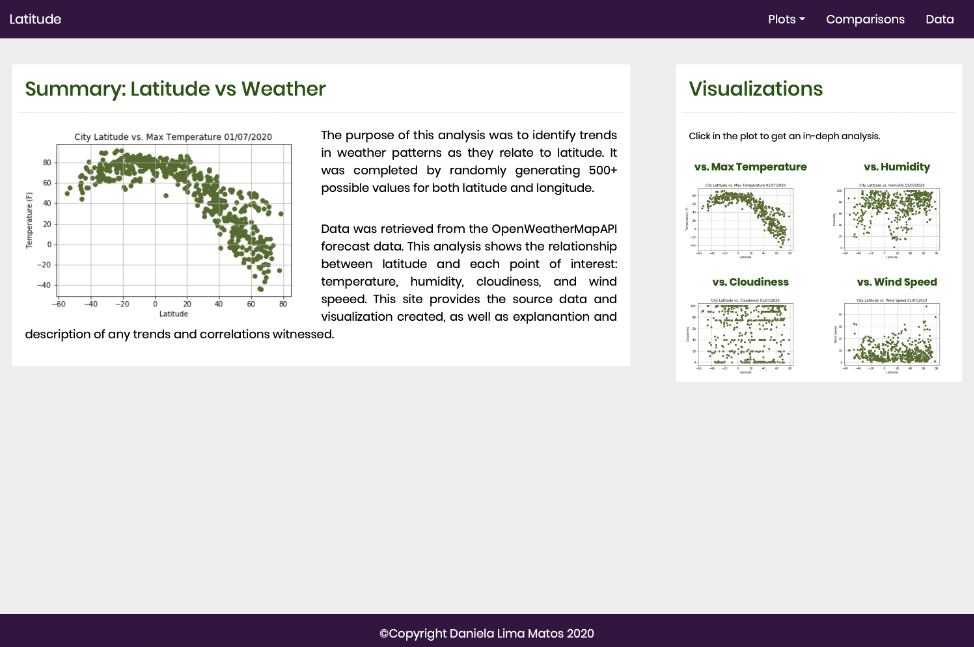

## Web Visualization Dashboard - Using HTML, CSS and Bootstrap.

This website attempts to answer the question - What's the weather like as we approach the equator? 
The data was pulled from OpenWeatherMap API and for the analysis I compared four environmental factors: temperature, humidity, cloudiness and windspeed. 

To create the webpage I used these websites as reference:

https://getbootstrap.com/docs/4.4/getting-started/introduction/

https://hackerthemes.com/bootstrap-cheatsheet/

https://www.w3schools.com/css/css_table.asp

http://convertcsv.com/csv-to-html.htm (to convert the csv to html)

#### Click here to view the page: https://daniela-matos.github.io/weather_web_visualization_dashboard/index.html

