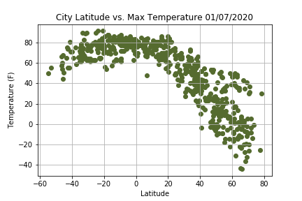
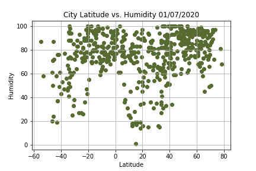
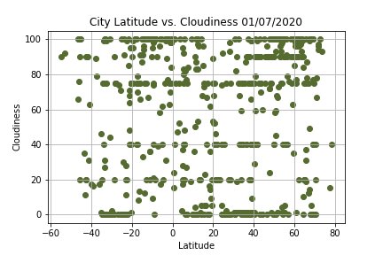
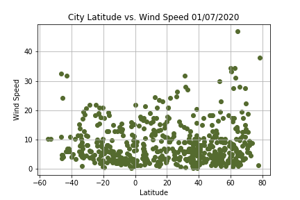

# What's the weather like as we approach the equator?

This project visualize the weather of 500+ cities across the world of varying distance from the equator. The data was pulled from OpenWeatherMap API. Python libraries used include pandas, numpy, citipy, time and matplotlib. Jupyter notebook was also used in order to interactively run the script and view the visualizations. 

